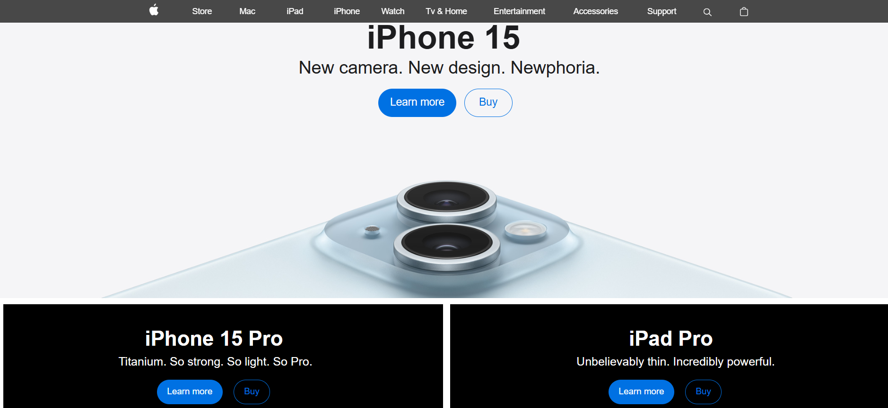

# 📱Apple Landing Page Clone | HTML & CSS

A **static clone** of the **Apple official website landing page** created using only HTML and CSS. This project focuses on foundational front-end web development skills including layout design, clean CSS styling, and basic animation effects.

---

## 🔍 Overview

- 🌐 **Tech Stack**: HTML5 & CSS3 (No JavaScript, no frameworks)
- 🎯 **Purpose**: To replicate a real-world landing page and practice classic layout structuring and styling.
- 📐 **Design Note**: This project is **non-responsive** and optimized for **desktop view only**.
- ✨ **Best viewed at screen resolution: `1519 x 730`**

---

## 📸 Preview

 <!-- Replace with actual preview image -->

---

## 📁 Features

- 🔷 Pixel-accurate imitation of Apple’s modern landing page layout
- 🖼️ Hero section and featured product displays
- 🎞️ Animated image slider section using CSS-only transitions
- 🎨 Smooth CSS hover animations and transitions for buttons
- 🧹 Organized, semantic HTML and modular CSS for easy maintenance

---

## 🗂️ Folder Structure

